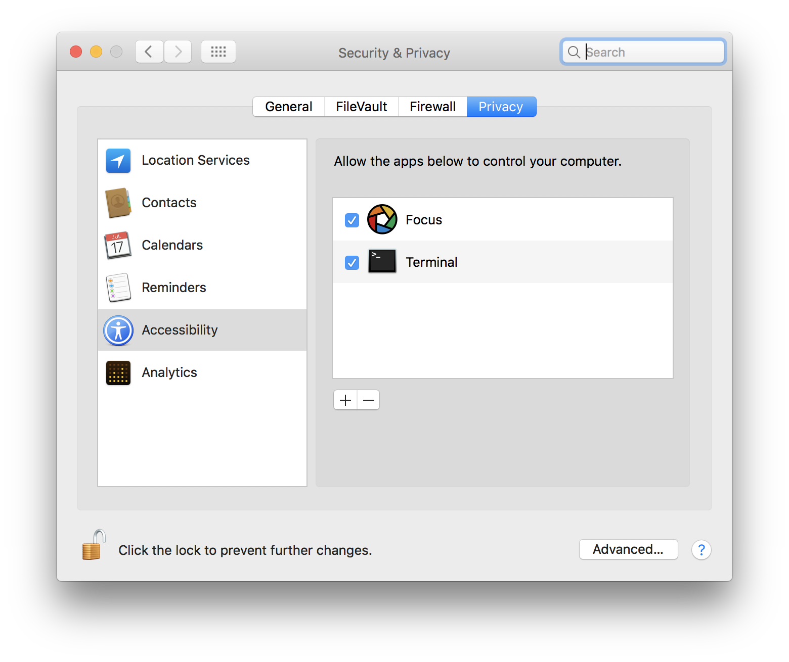

# Slack Focus

## Introduction

This app is made to work with [Focus App](https://heyfocus.com/) for MacOS, but
it can be used to simply enter and exist focus modes if you wish.

When toggling focus modes, the app will:

1. set your slack status
1. set your slack emoji
1. toggle your mac's 'do not disturb' mode

## Installation & Configuration

1. Either clone this repo or download it to a local directory on your mac
1. Within the `slack-focus/` directory create a file named `.env` with the contents of `.env.template` using the
   following command:
   ```
   cp .env.template .env
   ```
1. Change the messages and emojis in the `.env` file to whatever you like.
1. Create a legacy Slack API token at
   https://api.slack.com/custom-integrations/legacy-tokens
1. Replace `<SLACK TOKEN HERE>` in `.env` with the token you just created
1. In Focus app under Scripting, add the following lines, where `<PATH-TO-SLACK-FOCUS>` is the full path to where the `slack-focus` directory you created in step 1 lives.* I am using the default node installation location, but if it is different for you, then change that as well.
   * Focus
   ```bash
   # slack focus
   cd <PATH-TO-SLACK-FOCUS>
   /usr/local/bin/node . focus
   ```
   * Unfocus
   ```bash
   # slack focus
   cd <PATH-TO-SLACK-FOCUS>
   /usr/local/bin/node . unfocus
   ```
1. Under System Preferences > Security & Privacy > Privacy > Accessibility, give access to Focus (and Terminal if you want to use this through CLI) as seen below, so that it can set your do not disturb status.
   
1. Now when you focus or unfocus in Focus app, your slack and do not disturb state should change!

## Notes

\* You can find the path to your `slack-focus` directory by typing `pwd` from within the `slack-focus` directory.
